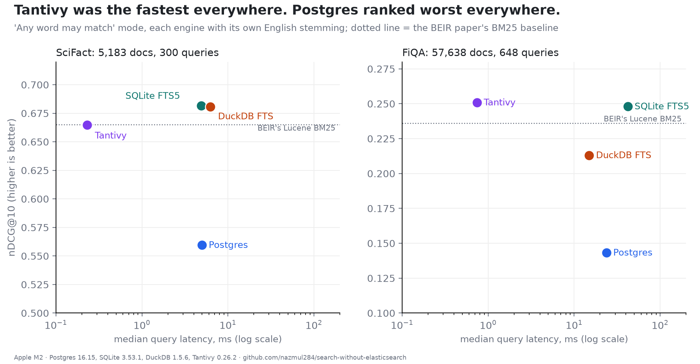

# search-without-elasticsearch

Postgres full-text search, SQLite FTS5, DuckDB's FTS extension and Tantivy, each with its own English analysis, scored on the BEIR SciFact and FiQA-2018 test sets (nDCG@10, recall@100) and timed. Companion to *Postgres Full-Text Search Ranked Last Against SQLite, DuckDB and Tantivy on Two Public Benchmarks*.



## Results

```
SciFact: 5,183 documents, 300 test queries, 'any word' mode

engine          nDCG@10  recall@100   p50 ms   p95 ms  build s     MB
-------------   -------  ----------   ------   ------  -------  -----
SQLite FTS5       0.682       0.925     4.90    12.69     0.19   17.7
DuckDB FTS        0.681       0.926     6.23     7.96     2.47   13.5
Tantivy           0.665       0.908     0.23     0.38     0.58    2.8
Postgres          0.560       0.847     4.98     9.97     1.12   19.7
BEIR BM25         0.665   (published Lucene baseline, for reference)


FiQA: 57,638 documents, 648 test queries, 'any word' mode

engine          nDCG@10  recall@100   p50 ms   p95 ms  build s     MB
-------------   -------  ----------   ------   ------  -------  -----
Tantivy           0.251       0.553     0.74     1.13     1.11   17.5
SQLite FTS5       0.248       0.555    42.10    85.87     1.76   84.1
DuckDB FTS        0.213       0.522    14.97    18.30    21.45   87.3
Postgres          0.143       0.391    23.75    50.80     6.13  109.1
BEIR BM25         0.236   (published Lucene baseline, for reference)


'All words must match': queries that returned nothing

engine          SciFact (of 300)   FiQA (of 648)
-------------   ----------------   -------------
Postgres                     274             393
SQLite FTS5                  284             450
Tantivy                      284             449
DuckDB FTS                   300             639
```

## Reproduce

```
uv venv -p 3.13 .venv && uv pip install -r requirements.txt
./fetch_data.sh
# needs a local Postgres on port 5499 with user 'bench'
python harness/bench.py scifact results/scifact.json
python harness/bench.py fiqa results/fiqa.json
python harness/tables.py
```

Measured on an 8 GB Apple M2, macOS, 7 October 2026. Absolute times are properties of this
laptop; the ratios between methods are what should travel.

## License

MIT
